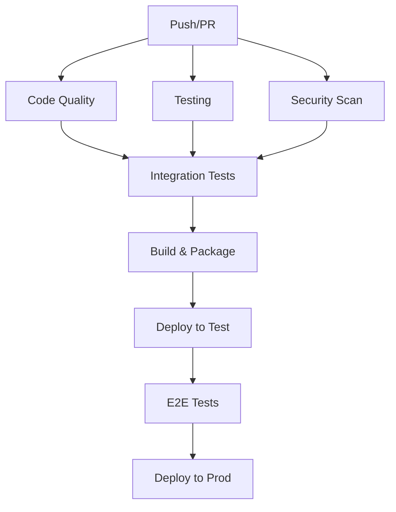

# CI/CD Workflow Setup Guide

This document provides comprehensive GitHub Actions workflows for the async-toolformer-orchestrator project.

## 🏗️ Workflow Architecture



## 📋 Required Workflows

### 1. Main CI Workflow

**File:** `.github/workflows/ci.yml`

```yaml
name: CI

on:
  push:
    branches: [ main, develop ]
  pull_request:
    branches: [ main, develop ]

env:
  PYTHON_VERSION: "3.11"

jobs:
  code-quality:
    runs-on: ubuntu-latest
    steps:
      - uses: actions/checkout@v4
      
      - name: Set up Python
        uses: actions/setup-python@v5
        with:
          python-version: ${{ env.PYTHON_VERSION }}
          
      - name: Install dependencies
        run: |
          pip install -e ".[dev]"
          
      - name: Run linting
        run: |
          ruff check .
          ruff format --check .
          
      - name: Run type checking
        run: mypy src/
        
      - name: Run security scan
        run: bandit -r src/ -f json

  test:
    runs-on: ${{ matrix.os }}
    strategy:
      matrix:
        os: [ubuntu-latest, windows-latest, macos-latest]
        python-version: ["3.10", "3.11", "3.12"]
        
    steps:
      - uses: actions/checkout@v4
      
      - name: Set up Python ${{ matrix.python-version }}
        uses: actions/setup-python@v5
        with:
          python-version: ${{ matrix.python-version }}
          
      - name: Install dependencies
        run: pip install -e ".[dev]"
        
      - name: Run unit tests
        run: pytest tests/unit/ -v --cov=async_toolformer
        
      - name: Run integration tests
        run: pytest tests/integration/ -v
        
      - name: Upload coverage
        uses: codecov/codecov-action@v4
        if: matrix.os == 'ubuntu-latest' && matrix.python-version == '3.11'
        
  build:
    needs: [code-quality, test]
    runs-on: ubuntu-latest
    steps:
      - uses: actions/checkout@v4
      
      - name: Set up Python
        uses: actions/setup-python@v5
        with:
          python-version: ${{ env.PYTHON_VERSION }}
          
      - name: Build package
        run: |
          pip install build
          python -m build
          
      - name: Upload artifacts
        uses: actions/upload-artifact@v4
        with:
          name: dist
          path: dist/
```

### 2. Security Workflow

**File:** `.github/workflows/security.yml`

```yaml
name: Security

on:
  push:
    branches: [ main ]
  pull_request:
    branches: [ main ]
  schedule:
    - cron: '0 2 * * 1'  # Monday 2 AM

jobs:
  dependency-scan:
    runs-on: ubuntu-latest
    steps:
      - uses: actions/checkout@v4
      
      - name: Set up Python
        uses: actions/setup-python@v5
        with:
          python-version: "3.11"
          
      - name: Install dependencies
        run: pip install -e ".[dev]" pip-audit
        
      - name: Run dependency audit
        run: pip-audit --format=json --output=audit-report.json
        
      - name: Upload audit report
        uses: actions/upload-artifact@v4
        with:
          name: security-audit
          path: audit-report.json

  codeql:
    runs-on: ubuntu-latest
    permissions:
      security-events: write
    steps:
      - uses: actions/checkout@v4
      
      - name: Initialize CodeQL
        uses: github/codeql-action/init@v3
        with:
          languages: python
          
      - name: Perform CodeQL Analysis
        uses: github/codeql-action/analyze@v3

  container-scan:
    runs-on: ubuntu-latest
    steps:
      - uses: actions/checkout@v4
      
      - name: Build Docker image
        run: docker build -t async-toolformer:test .
        
      - name: Run container scan
        uses: anchore/scan-action@v3
        with:
          image: async-toolformer:test
          format: sarif
          output-file: container-scan.sarif
          
      - name: Upload scan results
        uses: github/codeql-action/upload-sarif@v3
        with:
          sarif_file: container-scan.sarif
```

### 3. Release Workflow

**File:** `.github/workflows/release.yml`

```yaml
name: Release

on:
  push:
    tags:
      - 'v*.*.*'

jobs:
  test:
    runs-on: ubuntu-latest
    steps:
      - uses: actions/checkout@v4
      
      - name: Set up Python
        uses: actions/setup-python@v5
        with:
          python-version: "3.11"
          
      - name: Install dependencies
        run: pip install -e ".[dev]"
        
      - name: Run full test suite
        run: pytest --cov=async_toolformer --cov-report=xml
        
  build-and-publish:
    needs: test
    runs-on: ubuntu-latest
    environment: release
    permissions:
      id-token: write  # For trusted publishing
      
    steps:
      - uses: actions/checkout@v4
      
      - name: Set up Python
        uses: actions/setup-python@v5
        with:
          python-version: "3.11"
          
      - name: Install build dependencies
        run: pip install build twine
        
      - name: Build package
        run: python -m build
        
      - name: Check package
        run: twine check dist/*
        
      - name: Publish to PyPI
        uses: pypa/gh-action-pypi-publish@release/v1
        
  create-release:
    needs: build-and-publish
    runs-on: ubuntu-latest
    permissions:
      contents: write
      
    steps:
      - uses: actions/checkout@v4
        with:
          fetch-depth: 0
          
      - name: Generate changelog
        id: changelog
        run: |
          # Extract version from tag
          VERSION=${GITHUB_REF#refs/tags/v}
          
          # Generate changelog between tags
          CHANGELOG=$(git log --pretty=format:"- %s" $(git describe --tags --abbrev=0 HEAD^)..HEAD)
          
          echo "changelog<<EOF" >> $GITHUB_OUTPUT
          echo "$CHANGELOG" >> $GITHUB_OUTPUT
          echo "EOF" >> $GITHUB_OUTPUT
          echo "version=$VERSION" >> $GITHUB_OUTPUT
          
      - name: Create GitHub Release
        uses: actions/create-release@v1
        env:
          GITHUB_TOKEN: ${{ secrets.GITHUB_TOKEN }}
        with:
          tag_name: ${{ github.ref }}
          release_name: Release ${{ steps.changelog.outputs.version }}
          body: |
            ## Changes
            
            ${{ steps.changelog.outputs.changelog }}
            
            ## Installation
            
            ```bash
            pip install async-toolformer-orchestrator==${{ steps.changelog.outputs.version }}
            ```
          draft: false
          prerelease: false

  docker-release:
    needs: test
    runs-on: ubuntu-latest
    steps:
      - uses: actions/checkout@v4
      
      - name: Set up Docker Buildx
        uses: docker/setup-buildx-action@v3
        
      - name: Log in to Docker Hub
        uses: docker/login-action@v3
        with:
          username: ${{ secrets.DOCKER_USERNAME }}
          password: ${{ secrets.DOCKER_PASSWORD }}
          
      - name: Extract version
        id: version
        run: echo "version=${GITHUB_REF#refs/tags/v}" >> $GITHUB_OUTPUT
        
      - name: Build and push
        uses: docker/build-push-action@v5
        with:
          context: .
          push: true
          tags: |
            async-toolformer/orchestrator:latest
            async-toolformer/orchestrator:${{ steps.version.outputs.version }}
          platforms: linux/amd64,linux/arm64
```

### 4. E2E Testing Workflow

**File:** `.github/workflows/e2e.yml`

```yaml
name: E2E Tests

on:
  schedule:
    - cron: '0 6 * * *'  # Daily at 6 AM
  workflow_dispatch:
    inputs:
      test_env:
        description: 'Test environment'
        required: true
        default: 'staging'
        type: choice
        options:
          - staging
          - production

jobs:
  e2e-tests:
    runs-on: ubuntu-latest
    environment: ${{ github.event.inputs.test_env || 'staging' }}
    
    steps:
      - uses: actions/checkout@v4
      
      - name: Set up Python
        uses: actions/setup-python@v5
        with:
          python-version: "3.11"
          
      - name: Install dependencies
        run: pip install -e ".[dev]"
        
      - name: Run E2E tests
        env:
          OPENAI_API_KEY: ${{ secrets.OPENAI_API_KEY }}
          ANTHROPIC_API_KEY: ${{ secrets.ANTHROPIC_API_KEY }}
          TEST_ENV: ${{ github.event.inputs.test_env || 'staging' }}
        run: pytest tests/e2e/ -v --tb=short
        
      - name: Upload test results
        uses: actions/upload-artifact@v4
        if: always()
        with:
          name: e2e-test-results
          path: |
            test-results/
            logs/
```

## 🔧 Setup Instructions

### 1. Repository Secrets

Configure these secrets in your GitHub repository:

```bash
# PyPI Publishing
PYPI_API_TOKEN=your_pypi_token

# Docker Hub
DOCKER_USERNAME=your_docker_username  
DOCKER_PASSWORD=your_docker_password

# API Keys for E2E Testing
OPENAI_API_KEY=your_openai_key
ANTHROPIC_API_KEY=your_anthropic_key

# Optional: Notification integrations
SLACK_WEBHOOK_URL=your_slack_webhook
DISCORD_WEBHOOK_URL=your_discord_webhook
```

### 2. Branch Protection Rules

Apply these rules to the `main` branch:

- ✅ Require a pull request before merging
- ✅ Require approvals (1 minimum)
- ✅ Dismiss stale PR approvals when new commits are pushed
- ✅ Require review from code owners
- ✅ Require status checks to pass before merging:
  - `code-quality`
  - `test (ubuntu-latest, 3.11)`
  - `build`
- ✅ Require branches to be up to date before merging
- ✅ Require linear history
- ✅ Include administrators

### 3. Environment Setup

Create these environments in GitHub:

#### `staging`
- **Protection rules**: None
- **Secrets**: API keys for testing
- **Variables**: 
  - `ENVIRONMENT=staging`
  - `LOG_LEVEL=DEBUG`

#### `production`
- **Protection rules**: 
  - Required reviewers: Repository maintainers
  - Wait timer: 5 minutes
- **Secrets**: Production API keys
- **Variables**:
  - `ENVIRONMENT=production`
  - `LOG_LEVEL=INFO`

### 4. Additional Workflows

#### Performance Monitoring

**File:** `.github/workflows/performance.yml`

```yaml
name: Performance

on:
  push:
    branches: [ main ]
  pull_request:
    branches: [ main ]

jobs:
  benchmark:
    runs-on: ubuntu-latest
    steps:
      - uses: actions/checkout@v4
      
      - name: Set up Python
        uses: actions/setup-python@v5
        with:
          python-version: "3.11"
          
      - name: Install dependencies
        run: pip install -e ".[dev]" pytest-benchmark
        
      - name: Run benchmarks
        run: pytest benchmarks/ --benchmark-json=benchmark.json
        
      - name: Store benchmark result
        uses: benchmark-action/github-action-benchmark@v1
        with:
          tool: 'pytest'
          output-file-path: benchmark.json
          github-token: ${{ secrets.GITHUB_TOKEN }}
          auto-push: true
```

## 📊 Monitoring & Notifications

### Status Badges

Add these to your README.md:

```markdown
[](https://github.com/yourusername/async-toolformer-orchestrator/actions/workflows/ci.yml)
[](https://github.com/yourusername/async-toolformer-orchestrator/actions/workflows/security.yml)
[](https://codecov.io/gh/yourusername/async-toolformer-orchestrator)
```

### Notification Setup

Configure Slack/Discord notifications by adding this to your workflows:

```yaml
- name: Notify on failure
  if: failure()
  uses: 8398a7/action-slack@v3
  with:
    status: failure
    webhook_url: ${{ secrets.SLACK_WEBHOOK_URL }}
```

## 🚀 Deployment Strategy

### Gitflow Strategy

- `main`: Production-ready code
- `develop`: Integration branch for features
- `feature/*`: Feature development branches
- `release/*`: Release preparation branches
- `hotfix/*`: Emergency fixes

### Release Process

1. **Feature Development**: Create `feature/xyz` branch
2. **Integration**: Merge to `develop` branch
3. **Release Prep**: Create `release/v1.x.x` branch
4. **Testing**: Run full test suite on release branch
5. **Release**: Merge to `main` and tag `v1.x.x`
6. **Deploy**: Automated deployment via release workflow

This comprehensive CI/CD setup ensures high code quality, security, and reliable deployments for the async-toolformer-orchestrator project.